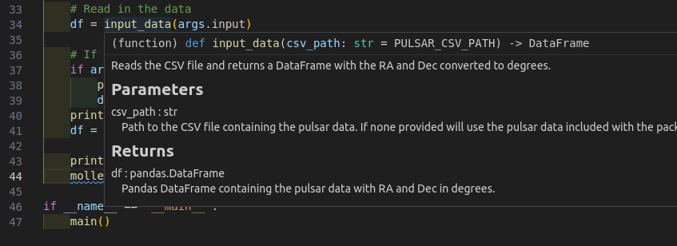
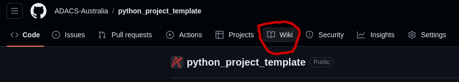
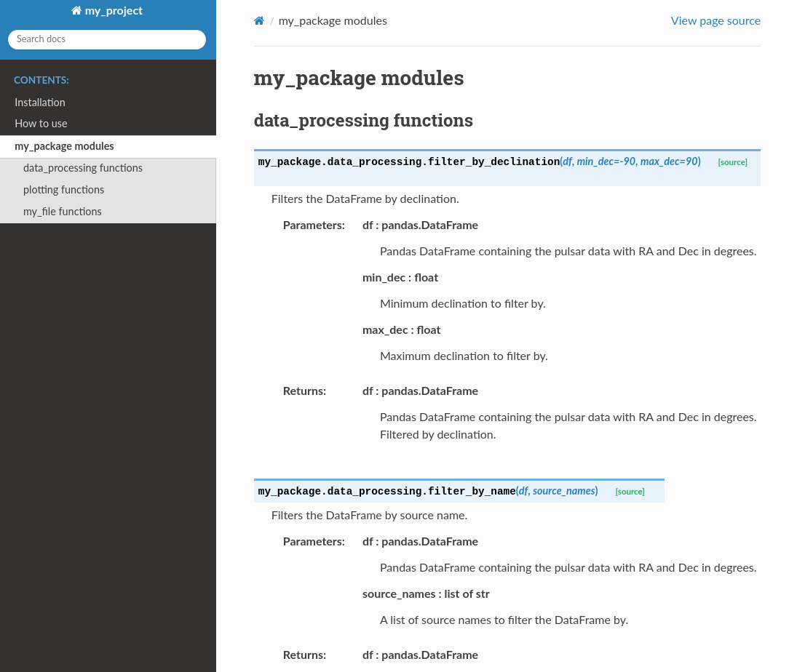
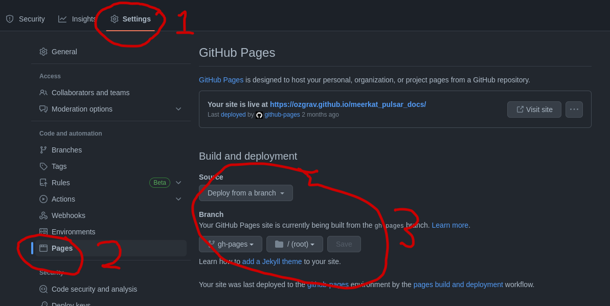
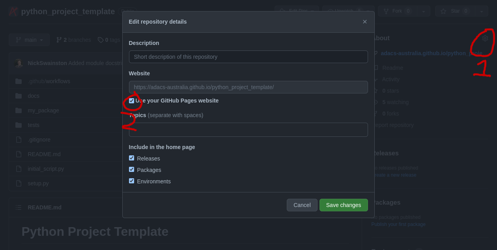

# Documentation
To avoid simulating the entire python interpreter in our minds, it is often easier to document the (intended) behavior of our code in a human readable format.

Python offers the builtin function `help()` to display the documentation for a given function.
Let's try that now.
> ## Challenge: Get some help
>
> Get some help on the python builtin function `open`
>
>
> ~~~
> help(open)
> ~~~
> {: .language-python}
>
> > ## Solution
> >
> >
> > ~~~
> > Help on built-in function open in module io:
> >
> > open(file, mode='r', buffering=-1, encoding=None, errors=None, newline=None, closefd=True, opener=None)
> >     Open file and return a stream.  Raise OSError upon failure.
> >
> >     file is either a text or byte string giving the name (and the path
> >     if the file isn't in the current working directory) of the file to
> >     be opened or an integer file descriptor of the file to be
> >     wrapped. (If a file descriptor is given, it is closed when the
> >     returned I/O object is closed, unless closefd is set to False.)
> >
> >     mode is an optional string that specifies the mode in which the file
> >     is opened. It defaults to 'r' which means open for reading in text
> >     mode.  Other common values are 'w' for writing (truncating the file if
> >     it already exists), 'x' for creating and writing to a new file, and
> >     'a' for appending (which on some Unix systems, means that all writes
> >     append to the end of the file regardless of the current seek position).
> >     In text mode, if encoding is not specified the encoding used is platform
> >     dependent: locale.getpreferredencoding(False) is called to get the
> >     current locale encoding. (For reading and writing raw bytes use binary
> >     mode and leave encoding unspecified.) The available modes are:
> > ...
> > ~~~
> > {: .output}
> {: .solution}
{: .challenge}

Where does `help()` get all this information from?

In part, the information provided by help is part of the *docstring* for the `open` function.
We can view the docstring by viewing the `__doc__` attribute of the function as follows:

> ## Example
> ~~~
> print(open.__doc__)
> ~~~
> {: .language-python}
> > ## Output
> > ~~~
> > Open file and return a stream.  Raise OSError upon failure.
> >
> > file is either a text or byte string giving the name (and the path
> > if the file isn't in the current working directory) of the file to
> > be opened or an integer file descriptor of the file to be
> > wrapped. (If a file descriptor is given, it is closed when the
> > returned I/O object is closed, unless closefd is set to False.)
> >
> > mode is an optional string that specifies the mode in which the file
> > is opened. It defaults to 'r' which means open for reading in text
> > mode.  Other common values are 'w' for writing (truncating the file if
> > it already exists), 'x' for creating and writing to a new file, and
> > 'a' for appending (which on some Unix systems, means that all writes
> > append to the end of the file regardless of the current seek position).
> > In text mode, if encoding is not specified the encoding used is platform
> > dependent: locale.getpreferredencoding(False) is called to get the
> > current locale encoding. (For reading and writing raw bytes use binary
> > mode and leave encoding unspecified.) The available modes are:
> > ...
> > ~~~
> > {: .output}
> {: .solution}
{: .challenge}

Compare the help shown above to the official python documentation [here](https://docs.python.org/3/library/functions.html#open).


## Documentation vs commenting
There are two ways in which you can and should describe your code - documentation and commenting.
These two ways of describing code have two audiences (which may overlap) - documentation is for the people who will **use** your code, whilst comments are for people who will **develop** your code.
Both of these audiences include you, the original developer, some 6 months in the future when you have forgotten all the details about what you were doing.
Quite simply:

> Documentation is a love letter that you write to your future self.
>
> -- Damian Conway
{: .quote}

## Types of documentation

There are lots of different types of documentation and there is no one-size-fits-all approach.
The type of documentation you write will depend on the type of code you are writing, and the audience you are writing for.

The following list is a rough order of importance for documentation types and as you software gets more complicated and the audience increases you should consider adding more types of documentation.

- [Comments]({{page.root}}#comments)
- [Docstrings]({{page.root}}#docstrings)
- [README]({{page.root}}#readme)
- [CLI help]({{page.root}}#cli-help)
- [Wiki or online documentation]({{page.root}}#wiki-or-online-documentation)
- [Automated documentation]({{page.root}}#automated-documentation)

## Comments
Comments should include design decisions, or explanations of difficult to interpret code chunks.
Comments can include known/expected bugs or shortcomings in the code.
Things that are not yet implemented, or hacks that deal with bugs in other modules, should also be in comments.
Comments are also a good place to reference where you saw a particular idea/approach or even code that you have copied:
~~~
def very_smart_function():
    # This function is a modified version of <stackoverflow perma link>
    ...
    return
~~~
{: .language-python}

Python comments come in two flavours: a single or part line comment which begins with a `#`, or a multiline comment which is any string literal.

~~~

'''
A comment that covers more than one line
because it is just soooooo long
'''

def my_func(num):
  # assume that num is some numeric type, or at the very least
  # an object which supports division against an integer
  ans = num / 2 # A partial line comment
  return ans
~~~
{: .language-python}


The partial-line comment plus multi-line commands can be used to great effect when defining functions, dictionaries, or lists:
~~~
dict = {'key1': 0, # note about this item
        'key2': 1, # another note
        }

def my_func(num,
            ax,            # a matplotlib axes object
            verbose=True,  # TODO update to be logger.isEnabledFor(logging.DEBUG)
            **kwargs):
    ...
    return
~~~
{: .language-python}

When python is interpreted (or compiled to byte-code), the interpreter will *ignore* the comments.
The comments therefore only exist in the source code.
Commenting your code has no effect on the behavior of your code, but it will (hopefully) increase your ability to understand what you did.
(Remember: Clarity is important).
Because the comments are ignored by the python interpreter only people with access to your source code will read them (developer usually), so this is a bad place to describe how your code should be *used*.
For notes about code *usage* we instead use documentation.

## Docstrings
Python provides a way for us to document the code inline, using [docstrings](https://www.python.org/dev/peps/pep-0257/).
Docstrings can be attached to functions, classes, or modules, and are defined using a simple syntax as follows:

> ## Example
> ~~~
> def my_func():
>   """
>   This is the doc-string for the function my_func.
>   I can type anything I like in here.
>   The only constraint is that I start and end with tripe quotes (' or ")
>   I can use multi-line strings like this, or just a single line string if I prefer.
>   """
>   ...
>   return
> ~~~
> {: .language-python}
{: .challenge}

Docstrings can be any valid string literal, meaning that they can be encased in either single or double quotes, but they need to be triple quoted.
Raw and unicode strings are also fine.

Docstrings can be included anywhere in your code, however unless they immediately follow the beginning of a file (for modules) or the definition of a class or function, they will be ignored by the compiler (treated as a comment).
The docstrings which are defined at the start of a module/class/function will be saved to the `__doc__` attribute of that object, and can be accessed by normal python [introspection](http://en.wikipedia.org/wiki/Type_introspection).

### Docstring formats
While it is possible to include any information in any format within a docstring it is clearly better to have some consistency in the formatting.
(Remember: Clarity is important)

There are, unfortunately, many 'standard' formats for python documentation, though they are all similarly human readable so the difference between the formats is mostly about consistency and automated documentation.

Scipy, Numpy, and astropy, all use the [numpydoc](https://numpydoc.readthedocs.io/en/latest/format.html) format which is particularly easy to read.
We will be working with the numpydoc format in this workshop.

Let's have a look at an extensive example from the numpydoc website.

> ## my_package/my_file.py
> ~~~
> """Docstring for the my_file.py module.
>
> Modules names should have short, all-lowercase names.  The module name may
> have underscores if this improves readability.
>
> Every module should have a docstring at the very top of the file.  The
> module's docstring may extend over multiple lines.  If your docstring does
> extend over multiple lines, the closing three quotation marks must be on
> a line by itself, preferably preceded by a blank line.
>
> """
> from __future__ import division, absolute_import, print_function
>
> import os  # standard library imports first
>
> # Do NOT import using *, e.g. from numpy import *
> #
> # Import the module using
> #
> #   import numpy
> #
> # instead or import individual functions as needed, e.g
> #
> #  from numpy import array, zeros
> #
> # If you prefer the use of abbreviated module names, we suggest the
> # convention used by NumPy itself::
>
> import numpy as np
> import matplotlib as mpl
> import matplotlib.pyplot as plt
>
> # These abbreviated names are not to be used in docstrings; users must
> # be able to paste and execute docstrings after importing only the
> # numpy module itself, unabbreviated.
>
>
> def my_function():
>     print("Hello World!")
>
>
> def documentation_example(var1, var2, *args, long_var_name='hi', **kwargs):
>     r"""Summarize the function in one line.
>
>     Several sentences providing an extended description. Refer to
>     variables using back-ticks, e.g. `var`.
>
>     Parameters
>     ----------
>     var1 : array_like
>         Array_like means all those objects -- lists, nested lists, etc. --
>         that can be converted to an array.  We can also refer to
>         variables like `var1`.
>     var2 : int
>         The type above can either refer to an actual Python type
>         (e.g. ``int``), or describe the type of the variable in more
>         detail, e.g. ``(N,) ndarray`` or ``array_like``.
>     *args : iterable
>         Other arguments.
>     long_var_name : {'hi', 'ho'}, optional
>         Choices in brackets, default first when optional.
>     **kwargs : dict
>         Keyword arguments.
>
>     Returns
>     -------
>     type
>         Explanation of anonymous return value of type ``type``.
>     describe : type
>         Explanation of return value named `describe`.
>     out : type
>         Explanation of `out`.
>     type_without_description
>
>     Other Parameters
>     ----------------
>     only_seldom_used_keywords : type
>         Explanation.
>     common_parameters_listed_above : type
>         Explanation.
>
>     Raises
>     ------
>     BadException
>         Because you shouldn't have done that.
>
>     See Also
>     --------
>     numpy.array : Relationship (optional).
>     numpy.ndarray : Relationship (optional), which could be fairly long, in
>                     which case the line wraps here.
>     numpy.dot, numpy.linalg.norm, numpy.eye
>
>     Notes
>     -----
>     Notes about the implementation algorithm (if needed).
>
>     This can have multiple paragraphs.
>
>     You may include some math:
>
>     .. math:: X(e^{j\omega } ) = x(n)e^{ - j\omega n}
>
>     And even use a Greek symbol like :math:`\omega` inline.
>
>     References
>     ----------
>     Cite the relevant literature, e.g. [1]_.  You may also cite these
>     references in the notes section above.
>
>     .. [1] O. McNoleg, "The integration of GIS, remote sensing,
>        expert systems and adaptive co-kriging for environmental habitat
>        modelling of the Highland Haggis using object-oriented, fuzzy-logic
>        and neural-network techniques," Computers & Geosciences, vol. 22,
>        pp. 585-588, 1996.
>
>     Examples
>     --------
>     These are written in doctest format, and should illustrate how to
>     use the function.
>
>     >>> a = [1, 2, 3]
>     >>> print([x + 3 for x in a])
>     [4, 5, 6]
>     >>> print("a\nb")
>     a
>     b
>     """
>     # After closing class docstring, there should be one blank line to
>     # separate following codes (according to PEP257).
>     # But for function, method and module, there should be no blank lines
>     # after closing the docstring.
>     pass
> ~~~
> {: .language-python}
{: .solution}

The example above is intentionally extensive, but you should be able to see what is going on.
This docstring format allows us to created automated documentation which we will go over [later]({{page.root}}#automated-documentation) but [here](https://adacs-australia.github.io/python_project_template/my_project_modules.html#module-my_package.my_file) is a sneak peak if you would like to see how it is rendered.
There are a few parts to the documentation format, some of which are considered essential, good practice, or optional.


### Essential documentation
The main goal of documentation is to describe the desired behavior or intended use of the code.
As such every docstring should contain at least a one line statement that shows the intent of the code.


> ## Document `input_data` and `molleweide_plot` v1
> For our `input_data` and `molleweide_plot` functions that we created earlier, add a few lines of documentation to describe the intent of the function.
>
> `git commit` your changes when you are happy with them
> > ## (partial) Solution
> > ~~~
> > def input_data(csv_path):
> >     """Reads the CSV file and returns a DataFrame with the RA and Dec converted to degrees.
> >     """
> >     # Read the CSV file into a DataFrame
> >     df = pd.read_csv(csv_path)
> >
> >     # Add new columns to df
> >     df['RA (deg)']  = 0
> >     df['Dec (deg)'] = 0
> >
> >     # Loop over dataframe and convert RA and Dec to degrees
> >     for index, row in df.iterrows():
> >         ra_hms  = row['RA (HMS)']
> >         dec_hms = row['Dec (DMS)']
> >
> >         # Create a SkyCoord object and specify the units
> >         c = SkyCoord(ra=ra_hms, dec=dec_hms, unit=(u.hourangle, u.deg))
> >         # Access the converted RA and Dec in degrees
> >         ra_deg  = c.ra.deg
> >         dec_deg = c.dec.deg
> >
> >         # Update the DataFrame with the converted values
> >         df.at[index, 'RA (deg)']  = ra_deg
> >         df.at[index, 'Dec (deg)'] = dec_deg
> >
> >     return df
> > ~~~
> > {: .language-python}
> >
> > ~~~
> > def molleweide_plot(df):
> >     """Plots the pulsars in a Molleweide projection and saves as a png called pulsar_plot.png.
> >     """
> >     # Plot the pulsars
> >     fig = plt.figure(figsize=(6, 4))
> >     # Molleweide projection gives us a nice view of the whole sky
> >     ax = plt.axes(projection='mollweide')
> >     plt.grid(True, color='gray', lw=0.5, linestyle='dotted')
> >     ax.set_xticklabels(['22h', '20h', '18h', '16h', '14h','12h','10h', '8h', '6h', '4h', '2h'])
> >
> >     # Convert RA and Dec to radians and plot
> >     ax.scatter(radians(-df['RA (deg)'] + 180), radians(df['Dec (deg)']), s=0.2)
> >     plt.savefig("pulsar_plot.png", dpi=300, bbox_inches='tight')
> > ~~~
> > {: .language-python}
> {: .solution}
{: .challenge}


### Good practice documentation
It is good practice to describe the expected input and output (or behavior) of your functions.

In the numpydoc format we put these into two sections:
- Parameters: for the input
- Returns: for the output

There is no "Modifies" section for the documentation (though you could add one if you like).
If the function modifies an input but does not return the modified version as an output then this should be included as part of the long form description.

> ## Document `input_data` and `molleweide_plot` v2
> Extend our documentation for `input_data` and `molleweide_plot` so that it includes a Parameters and Returns sections.
>
> `git commit` your changes when you are happy with them
> > ## Solution
> > ~~~
> > def input_data(csv_path):
> >     """Reads the CSV file and returns a DataFrame with the RA and Dec converted to degrees.
> >
> >     Parameters
> >     ----------
> >     csv_path : str
> >         Path to the CSV file containing the pulsar data.
> >         If none provided will use the pulsar data included with the package.
> >
> >     Returns
> >     -------
> >     df : pandas.DataFrame
> >         Pandas DataFrame containing the pulsar data with RA and Dec in degrees.
> >     """
> >     # Read the CSV file into a DataFrame
> >     df = pd.read_csv(csv_path)
> >
> >     # Add new columns to df
> >     df['RA (deg)']  = 0
> >     df['Dec (deg)'] = 0
> >
> >     # Loop over dataframe and convert RA and Dec to degrees
> >     for index, row in df.iterrows():
> >         ra_hms  = row['RA (HMS)']
> >         dec_hms = row['Dec (DMS)']
> >
> >         # Create a SkyCoord object and specify the units
> >         c = SkyCoord(ra=ra_hms, dec=dec_hms, unit=(u.hourangle, u.deg))
> >         # Access the converted RA and Dec in degrees
> >         ra_deg  = c.ra.deg
> >         dec_deg = c.dec.deg
> >
> >         # Update the DataFrame with the converted values
> >         df.at[index, 'RA (deg)']  = ra_deg
> >         df.at[index, 'Dec (deg)'] = dec_deg
> >
> >     return df
> > ~~~
> > {: .language-python}
> >
> > ~~~
> > def molleweide_plot(df):
> >     """Plots the pulsars in a Molleweide projection and saves as a png called pulsar_plot.png.
> >
> >     Parameters
> >     ----------
> >     df : pandas.DataFrame
> >         Pandas DataFrame containing the pulsar data with RA and Dec in degrees.
> >     """
> >     # Plot the pulsars
> >     fig = plt.figure(figsize=(6, 4))
> >     # Molleweide projection gives us a nice view of the whole sky
> >     ax = plt.axes(projection='mollweide')
> >     plt.grid(True, color='gray', lw=0.5, linestyle='dotted')
> >     ax.set_xticklabels(['22h', '20h', '18h', '16h', '14h','12h','10h', '8h', '6h', '4h', '2h'])
> >
> >     # Convert RA and Dec to radians and plot
> >     ax.scatter(radians(-df['RA (deg)'] + 180), radians(df['Dec (deg)']), s=0.2)
> >     plt.savefig("pulsar_plot.png", dpi=300, bbox_inches='tight')
> > ~~~
> > {: .language-python}
> {: .solution}
{: .challenge}

### Optional documentation
The type of errors that are raised, and under what conditions, can be documented in the `Raises` section.

`Notes`, `References`, and `Examples`, are also useful sections but not usually applicable to all functions or classes that you will be writing.
If I have used code snippets from stack-overflow or similar, then I find `Notes`/`References` section to be a good place to acknowledge and link to those resources.

The `Examples` section can be used to show intended use.
There is an automated testing suite called [doctest](https://docs.python.org/3/library/doctest.html) which will scan your docstrings looking for segments starting with `>>>` and then run those segments in an interactive python interpreter.
A solid test suite will typically contain many tests for a single function, thus trying to embed all the tests into your docstrings just makes for very long docstrings.
It is preferable to keep your testing code in the `tests` module/directory of your python module (see the episode on [testing]({{page.root}})), and to use the `Examples` section only for demonstrating functionality to the end user.

That are also tools that can automatically generate documentation from your docstrings such as [ChatGPT](https://chat.openai.com/) and [GitHub Copilot](https://github.com/features/copilot).
These tools are still in their infancy and so the documentation they generate is not always perfect, but is often a good starting point to speed up the process.

### Making use of docstrings
Some IDEs (the good ones) provide syntax highlighting, linting, and inline help as you write code.
By providing docstrings for all your functions you can make use of the linting and inline help.
Below is an example from [VSCode](https://code.visualstudio.com/) in which the docstring for a function is being shown to me as I code.



You can use the help from the python console like this:
~~~
Python 3.10.10 (main, Mar 21 2023, 18:45:11) [GCC 11.2.0] on linux
Type "help", "copyright", "credits" or "license" for more information.
>>> from my_package.data_processing import input_data
>>> help(input_data)
Help on function input_data in module my_package.data_processing:

input_data(csv_path='/home/nick/code/python_project_template/my_package/data/pulsars.csv')
    Reads the CSV file and returns a DataFrame with the RA and Dec converted to degrees.

    Parameters
    ----------
    csv_path : str
        Path to the CSV file containing the pulsar data.
        If none provided will use the pulsar data included with the package.

    Returns
    -------
    df : pandas.DataFrame
        Pandas DataFrame containing the pulsar data with RA and Dec in degrees.
>>>
~~~

Additionally you can compile all the documentation into a website or other document using an automated documentation tool as described in the next section.


## README.md

The README.md file is the first thing that people will see when they visit your repository on GitHub.
It is therefore important to have a good README.md file that explains what your code does and how to use it.
The README.md file should be written in [markdown](https://guides.github.com/features/mastering-markdown/) and should contain the following information:
- A brief description of what your code does.
- A list of dependencies (e.g. python packages) that are required to run your code.
- A brief description of how to install your code.
- A brief description of how to run your code.
- A brief description of how to cite your code.

~~~
# My Package

This package does some stuff.

## Dependencies

This package requires the following python packages:
- numpy
- pandas
- matplotlib
- argparse

## Installation

To install this package run:
```
pip install .
```

## Usage

To run the code use the following command:
```
filter_and_plot
```

This will create a `pulsar_plot.png` file in the current directory.

## Citation

If you use this code please give credit by citing [Swainston et al 2023](link_to_paper)
~~~
{: .language-markdown}

## CLI help

Consider creating a command line interface (CLI) for your code and providing an option of `--help` that gives users a quick intro to the use of your code.

For example, the argument parser we created for `filter_and_plot` in the previous episode outputs useful CLI documentation:

```
usage: filter_and_plot [-h] [-i INPUT]

Process and filter an input CSV file and create a sky plot of the sources.

options:
  -h, --help            show this help message and exit
  -i INPUT, --input INPUT
                        The path to the input csv file. Default: "pulsars.csv"
```
{: .output}


## Wiki or Online Documentation

GitHub and GitLab both provide a wiki for each repository.



These can easily be edited in your browser to create some quick documentation.

> ## your github repo wiki is also a repo
> - If you have a github repository at https://github.com/[user]/[repo].git, then you can clone the wiki corresponding to that repository from https://github.com/[user]/[repo].wiki.git
> - The wiki uses markdown formatting to render the pages.
> - You can of course still use the online editor to update the wiki, which is nice, because it has a 'preview' button.
{: .callout}


## Automated Documentation
If your docstrings are formatted in a regular way then you can make use of an automated documentation tool.
There are many such tools available with a range of sophistication.

One that is a bit difficult to use but has wonderful auto-documentation packages is [sphinx](https://www.sphinx-doc.org/en/master/).
It can write latex (and thus pdf), ePub, man pages, or plain text.
When set up correctly, you can create a GitHub Action to automatically generated documentation and display it on the GitHub Pages for your repository.


### Setting up sphinx documentation

First install sphinx using

```
pip install sphinx
```

Then you can make `sphinx` create a documentation template using

```
sphinx-quickstart docs
```

Which will create the following files: `conf.py`, `index.rst`, `make.bat` and `Makefile` in the `docs` directory.

I recommend changing `extensions` and `html_theme` in `docs/conf.py` to

```
extensions = [
    'sphinx.ext.autodoc',
    'sphinx.ext.doctest',
    'sphinx.ext.mathjax',
    'sphinx.ext.viewcode',
    'sphinx.ext.githubpages',
    'numpydoc',
    'myst_parser',
]

# ...

html_theme = 'sphinx_rtd_theme'
```
{: .language-python}


Lets create a page in our documentation that will automatically display the beautiful docstrings we have made for our functions.
To do this we will write the following in a file called `docs/my_project_modules.rst`

```
my_package modules
==================


data_processing functions
-------------------------

.. automodule:: my_package.data_processing
    :members:


plotting functions
------------------

.. automodule:: my_package.plotting
    :members:

my_file functions
-----------------

.. automodule:: my_package.my_file
    :members:
```

Each of these titles and commands is for each of the module files we created in the `my_package` directory.
`sphinx` will find all the functions in those module files and create a human readable webpage with all the information in the docstring.
To add this new page to your contents page, add the following to your `docs/index.rst`

```
.. toctree::
    :maxdepth: 3
    :caption: Contents:

    my_project_modules
```

To test this out, run the following command:

```
sphinx-build docs html
```

This will compile the documentation code in the `docs` directory and output it to a `html` directory.
Navigate to the `html` directory with your file manger and open the `index.html` file with your browser.
You should see a contents page and be able to navigate to the "my_package modules" page which should look something like this




Great! Now every time we update the docstrings, we can update the documentation.

### Documentation on GitHub Pages
To make this process even easier, lets set up a GitHub Action to regenerate the documentation every time you push a change to GitHub and update the webpage.
First lets set up a `docs/requirements.txt` file so that the GitHub Action knows what packages to install.
You can create a file using the command:

```
pip list --format freeze > docs/requirements.txt
```

You may have to remove some packages from this file that are not required for the documentation to build.
Here is an example that you can use if you run into any issues:

```
alabaster==0.7.13
Babel==2.12.1
certifi==2023.5.7
charset-normalizer==3.1.0
docutils==0.18.1
exceptiongroup==1.1.1
idna==3.4
imagesize==1.4.1
iniconfig==2.0.0
Jinja2==3.1.2
markdown-it-py==2.2.0
MarkupSafe==2.1.2
mdit-py-plugins==0.3.5
mdurl==0.1.2
myst-parser==1.0.0
numpydoc==1.5.0
packaging==23.1
pip==23.1
pluggy==1.0.0
Pygments==2.15.1
pytest==7.3.1
PyYAML==6.0
requests==2.30.0
setuptools==67.6.1
snowballstemmer==2.2.0
Sphinx==6.2.1
sphinx-rtd-theme==1.2.0
sphinxcontrib-applehelp==1.0.4
sphinxcontrib-devhelp==1.0.2
sphinxcontrib-htmlhelp==2.0.1
sphinxcontrib-jquery==4.1
sphinxcontrib-jsmath==1.0.1
sphinxcontrib-qthelp==1.0.3
sphinxcontrib-serializinghtml==1.1.5
tomli==2.0.1
urllib3==2.0.2
wheel==0.40.0
```

Next we will create a GitHub Action by creating a file called `.github/workflows/docs.yml` with the following contents:

```
name: Sphinx build

on:
  push:
    branches: [main]
  pull_request:
    branches: [main]

jobs:
  build:
    runs-on: ubuntu-latest

    steps:
      - name: Checkout repository
        uses: actions/checkout@v2

      - name: Set up Python
        uses: actions/setup-python@v4
        with:
          python-version: 3.10.6  # Replace with your desired Python version

      - name: Install dependencies
        run: |
          python -m pip install --upgrade pip
          pip install -r docs/requirements.txt
          pip install .

      - name: Build documentation
        run: |
          cd docs
          make html

      - name: Deploy to GitHub Pages
        uses: peaceiris/actions-gh-pages@v3
        with:
          personal_token: ${{ secrets.GITHUB_TOKEN }}
          publish_dir: ./docs/_build/html
```
{: .language-yaml}

Lets breifly go through what each of these steps does.

```
on:
  push:
    branches: [main]
  pull_request:
    branches: [main]
```
{: .language-yaml}

This defines when the GitHub Action should run. In this case, it will run every time you push a change to the `main` branch or make a pull request to the `main` branch.

```
jobs:
  build:
    runs-on: ubuntu-latest

    steps:
```
{: .language-yaml}

This defines the job that will be run. In this case, it will run on the latest version of Ubuntu.

```
      - name: Checkout repository
        uses: actions/checkout@v2
```
{: .language-yaml}

Will clone and checkout the repository.

```
      - name: Set up Python
        uses: actions/setup-python@v4
        with:
          python-version: 3.10.6  # Replace with your desired Python version
```
{: .language-yaml}

Will set up the Python version that will be used to build the documentation.

```
      - name: Install dependencies
        run: |
          python -m pip install --upgrade pip
          pip install -r docs/requirements.txt
          pip install .
```
{: .language-yaml}
```

Will install the dependencies required to build the documentation and your package.

```
      - name: Build documentation
        run: |
          cd docs
          make html
```
{: .language-yaml}

Will build the documentation.

```
      - name: Deploy to GitHub Pages
        uses: peaceiris/actions-gh-pages@v3
        with:
          personal_token: ${{ secrets.GITHUB_TOKEN }}
          publish_dir: ./docs/_build/html
```
{: .language-yaml}

Will deploy the documentation to GitHub Pages.

Git add, commmit, and push this file and you should see a GitHub Action start running.
If it completes without errors there should be a new branch called `gh-pages` and a new webpage at `https://<your_username>.github.io/<your_repo_name>/`.
If you don't already see the webpage you may have to turn it on in settings by pointing at the root directory on the `gh-pages`` branch.



You can then add this link to the GitHub description of your repository so that users can easily find the documentation.
You can also add it to the about section on the right by clicking the gear and ticking the box to use your GitHub Pages website.



You documentation is now easy to find and can easily and automatically be updated.

Some futher things you may want to include in your documentation are:
- a guide for downloading/compiling/installing your software
- a 'quick-start' guide or set of examples for new users
- a Frequently Asked Questions (FAQ) section to address common problems
- tutorials to demonstrate some of the key features of your software (Jupyter notebooks are great here)


If you would like some examples of how astronomy software is documentated you can check out:
  - [AstroPy documentation](https://astropy.readthedocs.io/en/stable/) (an extreme example)
  - [Aegean wiki](https://github.com/PaulHancock/Aegean/wiki) (a great example of how to use the GitHub wiki)
  - [pulsar_spectra](https://pulsar-spectra.readthedocs.io/en/latest/) (a shameless plug of Nick Swainston's software)


