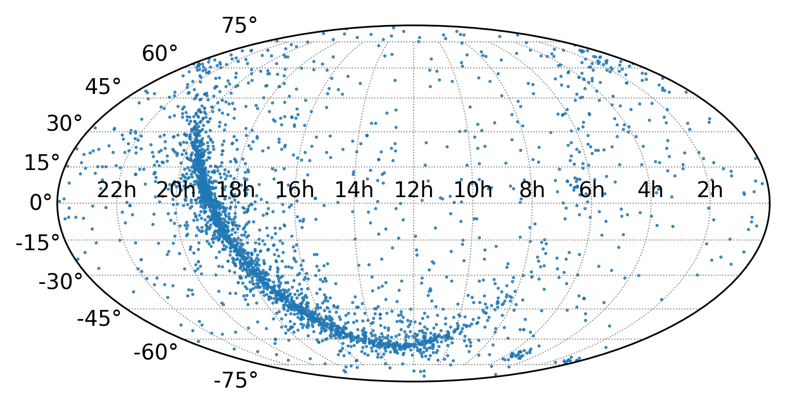

To create a simple example we shall create a python script that creates a sky plot of all the sources in a csv file.

To download the example csv file which contains all known pulsar, run the following command in your terminal:

```
wget https://raw.githubusercontent.com/ADACS-Australia/python_project_template/main/my_package/data/pulsars.csv
```

You can look at the first 10 lines of the file with the `head` command:

```
head pulsars.csv
```
```
Source Name,RA (HMS),Dec (DMS)
J0002+6216,00:02:58.17,+62:16:09.4
J0006+1834,00:06:04.8,+18:34:59
J0007+7303,00:07:01.7,+73:03:07.4
J0011+08,00:11:34,+08:10
J0012+5431,00:12:23.3,+54:31:47
J0014+4746,00:14:17.75,47:46:33.4
J0021-0909,00:21:51.47,-09:09:58.7
J0023+0923,00:23:16.8765345,+09:23:23.87696989
J0024-7204C,00:23:50.3546,-72:04:31.5048
```
{: .output}

The first line of the file is a header that describes the contents of the file. The rest of the file contains the names of pulsars and their positions in the sky.

The following is a simple script that will read in the csv and create a plot

```
import pandas as pd
from astropy.coordinates import SkyCoord
import astropy.units as u
import matplotlib.pyplot as plt
from numpy import radians

# Read the CSV file into a DataFrame
df = pd.read_csv('pulsars.csv')

# Add new columns to df
df['RA (deg)']  = 0
df['Dec (deg)'] = 0

# Loop over dataframe and convert RA and Dec to degrees
for index, row in df.iterrows():
    ra_hms  = row['RA (HMS)']
    dec_hms = row['Dec (DMS)']

    # Create a SkyCoord object and specify the units
    c = SkyCoord(ra=ra_hms, dec=dec_hms, unit=(u.hourangle, u.deg))
    # Access the converted RA and Dec in degrees
    ra_deg  = c.ra.deg
    dec_deg = c.dec.deg

    # Update the DataFrame with the converted values
    df.at[index, 'RA (deg)']  = ra_deg
    df.at[index, 'Dec (deg)'] = dec_deg

# Print the DataFrame to check the degree calculation
print(df)

# Plot the pulsars
fig = plt.figure(figsize=(6, 4))
# Mollewide projection gives us a nice view of the whole sky
ax = plt.axes(projection='mollweide')
plt.grid(True, color='gray', lw=0.5, linestyle='dotted')
ax.set_xticklabels(['22h', '20h', '18h', '16h', '14h','12h','10h', '8h', '6h', '4h', '2h'])

# Convert RA and Dec to radians and plot
ax.scatter(radians(-df['RA (deg)'] + 180), radians(df['Dec (deg)']), s=0.2)
plt.savefig("pulsar_plot.png", dpi=300, bbox_inches='tight')
```
{: .language-python}

Which produces the following plot:



This is a nice starting point as it is a reproducible script (if we run it again we will get the same result as long as we have `pulsars.csv`).
If we are making this plot once for a paper or a presentation the only left to do is to put the script and csv file on GitHub so we always have access to it.

One thing to discuss is why we used `pandas` and `astropy` instead of reading in the csv manually and converting the RA and Dec to degrees ourselves?
One reason is that a best practice in python is to use existing libraries instead of writing your own code (don't recreate the wheel).
This is because existing libraries have been tested and are more likely to be bug free (have already considered weird edge cases you don't have to).

Another reason is that `pandas` has a lot of features that make it easy to work with data.
If you instead used a list of lists to store all the values you can easily lose track of what each value represents as you add more values.
With `pandas` you can name each column with their units and access the values by name instead of index.
You can also put the column right into the plot (`ax.scatter(`) without having to convert it to a list first.
There are also many other features to filter your data which we will go over briefly in and you can read more about in the [pandas documentation](https://pandas.pydata.org/docs/) or a previous [ADACS workshop](https://adacs-australia.github.io/HWSA-2022/04-BestPracticesInComputing/index.html).

Now let us put our code on GitHub.
